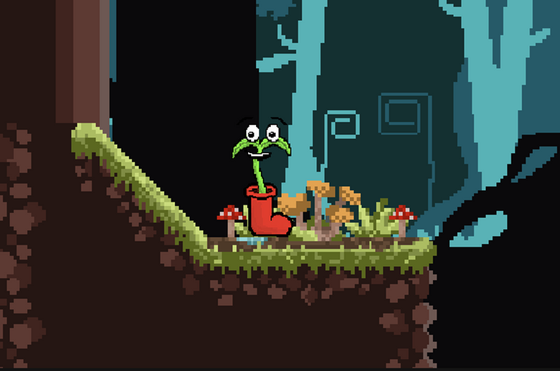
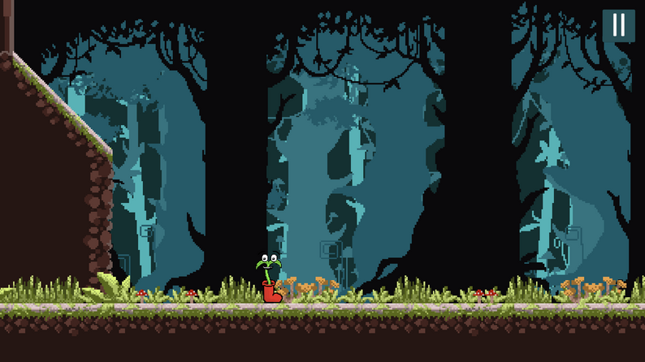
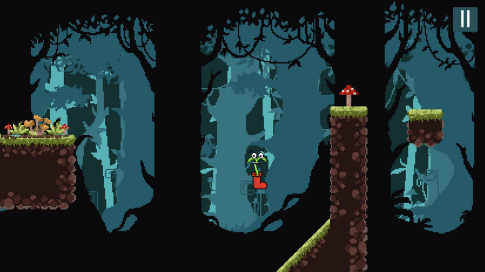

# Climb High - A Vertical Rage Platformer

## Playable on Itch.io!

  

Welcome to the repository for **Climb High**, a solo-developed 3D vertical platformer inspired by challenging classics like *Jump King*. This game is a test of patience and precision, featuring a punishing but fair ascent with no checkpoints. The player takes on the role of a determined plant, climbing through an ever-changing forest environment to reach the top.

---

### 🖼️ In-Game Screenshots

| Main character | The Forest Floor | Jumping to Platforms |
| :---: | :---: | :---: |
|  |  |  |

---

### ✨ Key Features

* **Unforgiving Vertical Challenge:** The entire game is one continuous vertical level. Every jump is critical, and a single missed ledge can send you plummeting back down.
* **Physics-Based Precision Platforming:** The player's movement is entirely physics-based, requiring careful control over jump height and direction.
* **Dynamic & Evolving Environments:** As you climb higher, the theme of the forest changes, introducing new visuals and platforming challenges.

---

### 💻 Technical Implementation

As the sole developer, I was responsible for all core systems, written in C#:

* **Player Controller:** Wrote the scripts for the character's movement, including the sensitive, physics-based jumping mechanic.
* **Collision Detection:** Implemented robust collision handling to ensure fair interactions.
* **Camera System:** Developed a smooth camera that follows the player's vertical progress.

---

### 🔧 Tech Stack

* **Game Engine:** Unity
* **Language:** C#
* **Platform:** [itch.io](https://sspeed.itch.io/climb-high)

---

*A Note on Assets:* To focus on core programming and design, all 3D models and textures used in this project were sourced from the Unity Asset Store.
